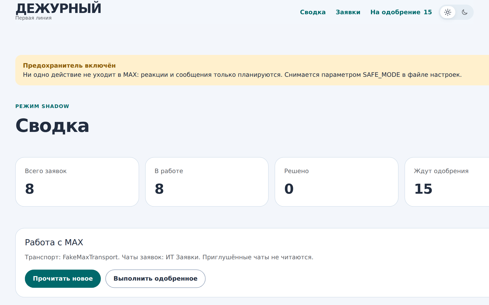
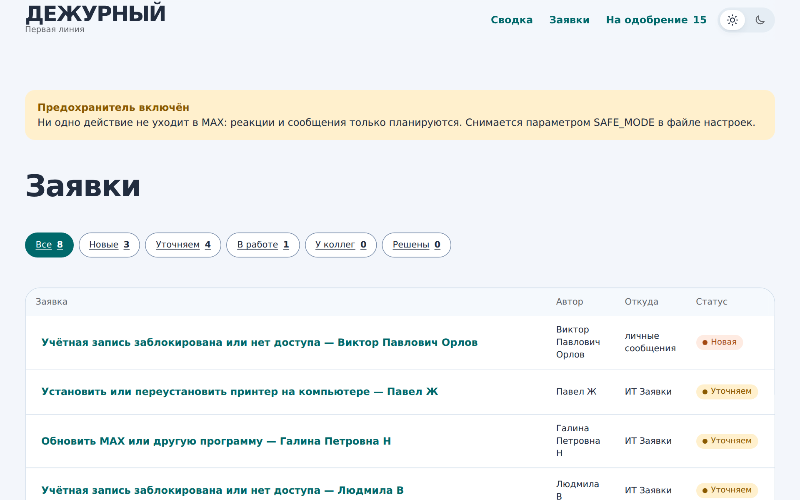
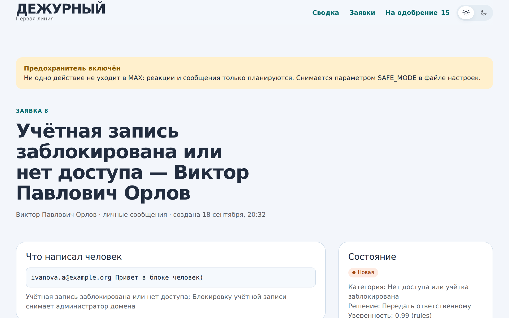
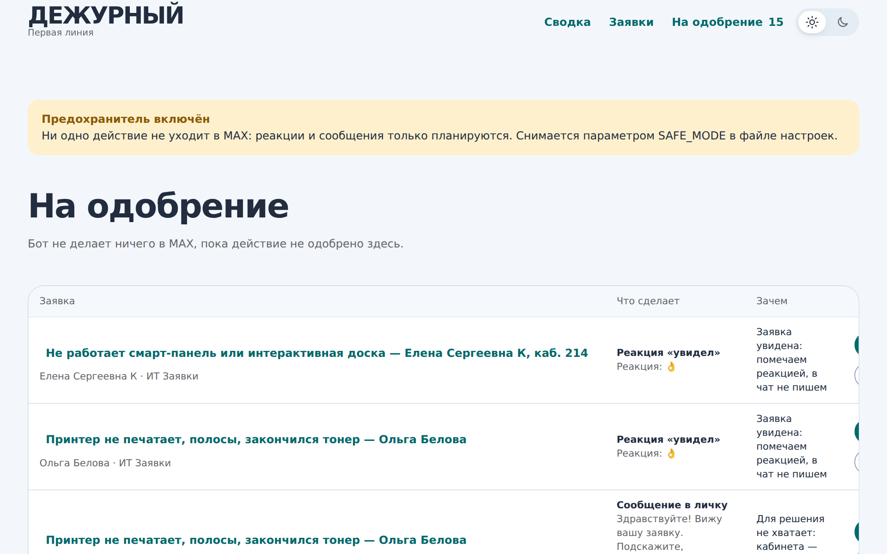

<div align="center">

# Дежурный

**AI-диспетчер первой линии IT-поддержки для мессенджера MAX**

Читает чат заявок, понимает, что случилось, решает типовое сам
и заводит тикет на всё остальное. Без единого сообщения в общий чат.




</div>

## Зачем

В небольшой организации заявки в IT приходят в общий рабочий чат: «нет доступа», «тонер», «принтер на новый комп».
Восемь из десяти типовые, но каждая отнимает у дежурного пару минут на переписку.
«Дежурный» разбирает поток сам: ставит реакцию «увидел», уточняет недостающее **в личке**,
отвечает из базы знаний, а действия (например, скрипт через Aspia) кладёт в очередь на одобрение оператору.

Главное требование — **безопасность**: бот работает в живом чате с коллегами, и ошибочное сообщение туда нельзя отменить.
Поэтому правила поведения зашиты в код и покрыты отдельными тестами.

## Правила, которые нельзя нарушать

Это не пожелания, а инварианты: на каждое есть тест в `tests/test_safety.py`,
и если он краснеет, изменение нельзя выпускать.

1. **В чат заявок бот не пишет никогда** — только реакции: `👌` увидел,
   `✔️` закрыто. Предохранитель стоит трижды: в транспорте, в политике и в
   исполнителе.
2. **Уточнения и ответы — только в личных сообщениях** автору обращения.
3. **Приглушённый чат не рабочий** и не читается вообще: ни сообщений, ни
   реакций, ни тикетов.
4. **Любое действие сначала попадает в таблицу `actions`** и ждёт одобрения
   оператора в интерфейсе.
5. **Объявления и благодарности не получают даже реакции** — это не заявки.
6. **`SAFE_MODE=true` останавливает всё**, что уходит наружу, независимо от
   режима и одобрений.

## Быстрый старт

```bash
python -m venv .venv
. .venv/bin/activate                  # Windows: .venv\Scripts\activate
pip install -r requirements.txt
copy .env.example .env                # Linux/macOS: cp .env.example .env

python -m sandbox.app                 # стенд-клон MAX на :8765 (отдельное окно)
python -m app.web.app                 # интерфейс оператора на :8000
```

По умолчанию проект запускается в самой безопасной конфигурации: транспорт —
заглушка с тестовыми данными, режим `shadow`, предохранитель включён. В таком
виде он не может коснуться живого аккаунта MAX даже при ошибке в коде.

Служба фонового опроса:

```bash
python -m app.service --once          # один круг, показать отчёт
python -m app.service                 # постоянная работа
python -m app.service --with-web      # служба и интерфейс в одном процессе
```

Тесты:

```bash
python -m unittest discover -s tests -t .     # или: pytest tests -v
```

## Как это работает

```
MAX ──транспорт──► сообщение ──правила──► категория ──политика──► план действий
                                   │                                    │
                          локальная модель                    таблица actions
                        (только если правила                          │
                           сомневаются)                     одобрение оператора
                                                                      │
                                                    реакция · сообщение в личку ·
                                                    Aspia · передача коллеге
```

**Правила решают первыми.** Восемь-девять заявок из десяти — типовые фразы
(«нет доступа», «тонер», «обновить макс»). Правила отвечают на них мгновенно и
одинаково, их можно прочитать глазами и поправить. Локальная модель через
LM Studio подключается только там, где правила промолчали, и если её нет —
бот продолжает работать на правилах.

**Заявка помнит разговор.** Человек пишет в чат «нет доступа», бот в личке
спрашивает почту, человек присылает почту отдельным сообщением — это одна
заявка, а не три. Склейка идёт по автору и работает между чатами, потому что
разговор начинается в чате заявок и продолжается в личке.

**Чего не хватает и что нужно сделать — разные вещи.** Заблокированная учётка
остаётся заблокированной учёткой, даже если почта ещё неизвестна. Поле
`blocked_on` хранит недостающие данные, а `resolution` — намерение, поэтому
после ответа пользователя система помнит, что собиралась делать.

## Структура

| Путь | Что там |
|---|---|
| `app/domain.py` | категории, статусы, типы действий — чистая предметная область |
| `app/store.py` | хранилище на `sqlite3`, без ORM |
| `app/core/rules.py` | правила и извлечение сущностей — правится чаще всего |
| `app/core/llm.py` | локальная модель, необязательная деталь |
| `app/core/policy.py` | правила поведения бота, выраженные кодом |
| `app/core/pipeline.py` | главный цикл и склейка разговора |
| `app/executors/` | Aspia с белым списком, эскалация, исполнитель действий |
| `app/transports/` | связь с MAX за интерфейсом `MaxTransport` |
| `app/web/` | интерфейс оператора (Flask + Jinja, своя мини-дизайн-система без зависимостей) |
| `sandbox/` | стенд-клон веб-клиента MAX для безопасной отладки |
| `kb/` | база знаний: markdown с frontmatter |
| `tests/` | 55 тестов, из них 10 — на нерушимые правила |

## Стенд вместо живого аккаунта

`sandbox/` — мини-клон веб-клиента MAX со своими тестовыми данными: 7 чатов,
12 заявок, приглушённые чаты, панель реакций. Транспорт на Playwright
разрабатывается и тестируется против него, а не против рабочего аккаунта, где
ошибочная реакция уходит живым коллегам и отменить её нельзя.

Стенд помечает каждый нужный элемент атрибутом `data-testid` — это контракт
между стендом и транспортом. При переходе на настоящий MAX меняются только
значения в словаре `SELECTORS`, а логика транспорта остаётся.

| Ручка стенда | Зачем |
|---|---|
| `POST /api/reset` | вернуть исходные тестовые данные |
| `GET /api/audit` | что бот сделал: реакции и отправленные сообщения |
| `GET /api/chats` | список чатов с флагами, для сверки |

## Режимы работы

| Режим | Что делает сам |
|---|---|
| `shadow` | ничего; каждое действие ждёт кнопки «Одобрить» |
| `assisted` | сам ставит реакцию «увидел»; сообщения и скрипты — с одобрения |
| `auto` | всё сам (включать по одной категории, когда накопится статистика) |

Поверх режимов — `SAFE_MODE`. Пока он `true`, наружу не уходит ничего, а
действия помечаются как пропущенные с пояснением. Снимать вручную и осознанно.

## База знаний

Статья в `kb/` — одновременно инструкция для человека и данные для бота:

```markdown
---
slug: printer-install
categories: [printer, software_install]
needs: [aspia_code]          # без этого заявку не выполнить
resolution: remote_script
script: install_printer      # сценарий из белого списка Aspia
---
**Ответ пользователю:**
Сделаю удалённо, приходить не нужно. Пришлите код из приложения Aspia…
```

Новая статья подхватывается без перезапуска.

## Скриншоты

| Заявки | Карточка заявки | Очередь на одобрение |
|---|---|---|
|  |  |  |

## Дорожная карта

- [x] Правила + извлечение сущностей (почта, кабинет, код Aspia)
- [x] Склейка разговора между общим чатом и личкой
- [x] Политика поведения с тройным предохранителем и тестами
- [x] Очередь действий с одобрением оператора, режимы `shadow` / `assisted` / `auto`
- [x] Стенд-клон веб-клиента MAX для безопасной отладки
- [ ] Транспорт на Playwright против живого MAX (сейчас отлажен на стенде)
- [ ] Проверка аргументов Aspia на реальной машине
- [ ] Метрики: доля заявок, закрытых без человека

## Стек и решения

- **Python 3.11, Flask, Jinja** — интерфейс локальный и маленький, SPA здесь избыточен.
- **sqlite3 без ORM** — одна таблица на сущность, миграции не нужны, база в одном файле.
- **Правила впереди модели.** LLM (любая OpenAI-совместимая: LM Studio, Ollama) — необязательный слой: если её нет, бот продолжает работать на правилах.
- **Транспорт за интерфейсом** `MaxTransport`: заглушка для тестов, стенд, живой MAX — логика не меняется.

## Лицензия

MIT © [Hoonkero](https://github.com/Hoonkero)
